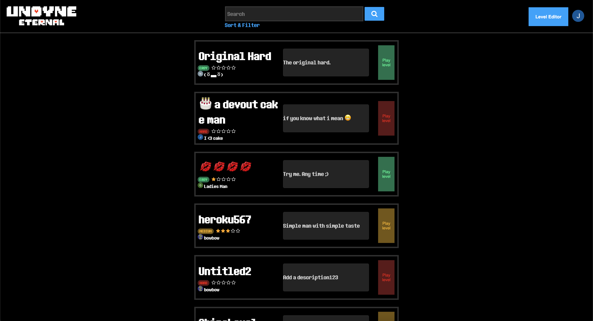
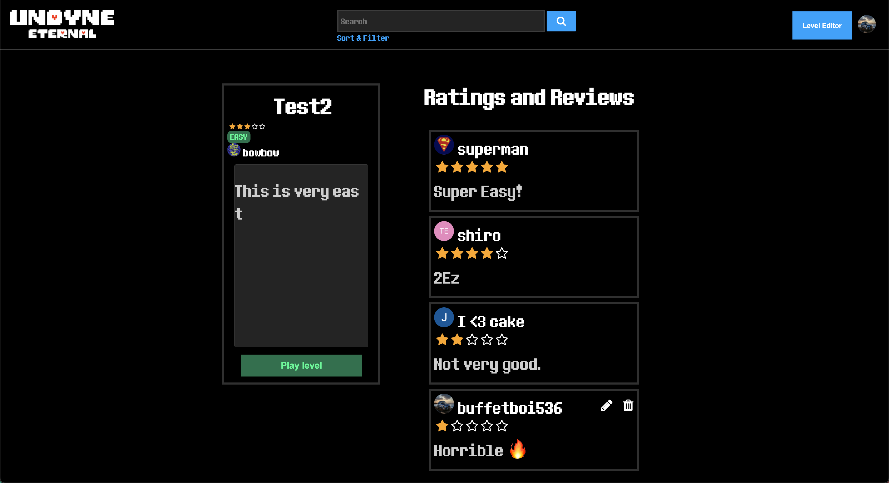
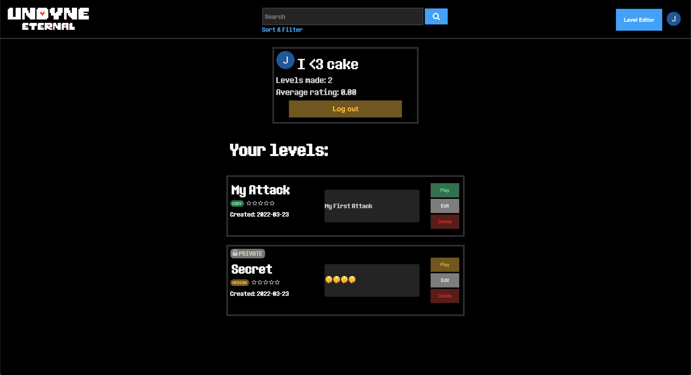
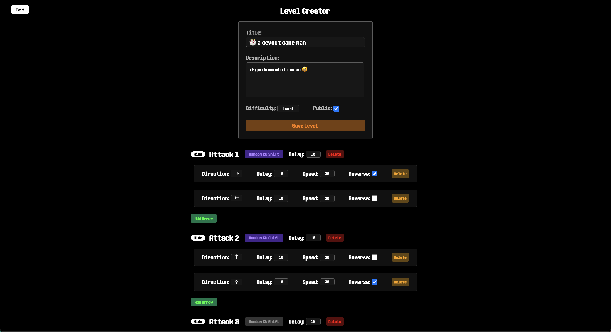
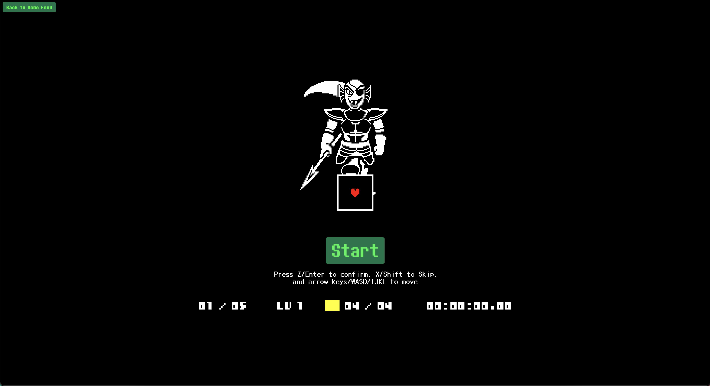

## App Info:

* App Name: Undyne – Eternal

## How to Run the Project

1. Add URL for PostgreSQL configurations in a .env file in the root directory of the project.
(DOMAIN, CLIENT_ID, CLIENT_SECRET, DATABASE_URL)
2. Add URL for Firebase configurations in a .env file in the root directory of the project (for firebase storage used to store PFP) 
(type, project_id, private_key_id, private_key, client_email, client_id, auth_uri, token_uri, auth_provider_x509_cert_url, client_x509_cert_url).
3. Add a random secret key in .env file in the root directory of the project (SECRET_KEY).
4. Run pipenv install to install all dependencies.
5. Run flask run to run the project.

## Key Features

* Added searching, filtering, and sorting levels based on title, description, difficulty, rating, and time.
* Redesigned the game from scratch to improve its structure, reduce bad practices, and incorporate it when our ideals.
* Developed a level creator in which users can design their own levels with many custom options and a cool user interface.
* Made it possible for user to pick their own unique username after logging in and integrating it with Auth0, accounting for users who try to use the same email with different login options.

## Screenshots of Site

The home feed in which you can see all of the posted levels and search, sort, and filter.

The page you see when you click on a level. Here you can, play the level, write a review with a rating, or play the level.

The page you see when on your own profile, which is also similar to the view of others' profiles. Here, you can view, play, edit, or delete your levels and view a couple user metrics.

This is the level creator where you can build levels to play and share with others.

This is the game page where you can play anyone's levels.

## Mockup

Wireframe link: https://framer.com/share/UNDYNE--jIlIFQL6MHGJ5Dj21T4k/PVzi9pijX

There are three main parts to the wireframe. The first is the social media part consisting of the following three pages: the main feed page, the level page, and the user profile page. Then, there is the game part, which is launched from any of the social-media-related pages by launching it from any of the levels. The third is the level creator where users can design their own levels.

## External Dependencies

* PIXI.js
* howler.js
* pydantic
* firebase_admin

The game was based off Fairdyne by Joe Zeng but rewrote a large majority of it from scratch.
